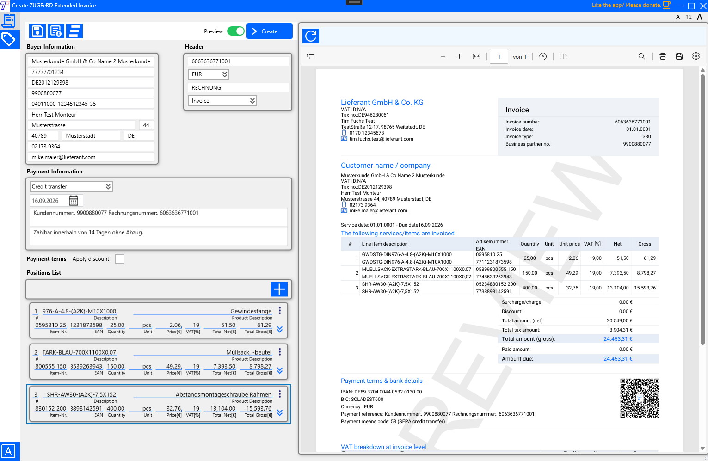
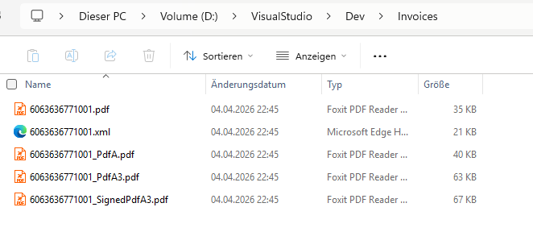

# tulo.eInvoiceCreatorZUGFeRD

> An open-source, professional WPF desktop application for creating, previewing, archiving, and digitally signing
> fully compliant electronic invoices in **ZUGFeRD 2.4 EXTENDED / Factur-X 1.0** format — built on **.NET 8**,
> designed for real business use, and ready to run without an installer.

  

 

[📄 Example Pdf invoice — 6063636771001.pdf](./ReadMeAsserts/6063636771001.pdf)

[📄 Example Xml invoice — 6063636771001.xml](./ReadMeAsserts/6063636771001.xml)

[📄 Example Pdf/A3 invoice — 6063636771001_PdfA3.pdf](./ReadMeAsserts/6063636771001_PdfA3.pdf)

[📄 Example signed Pdf/A3 invoice — 6063636771001_SignedPdfA3.pdf](./ReadMeAsserts/6063636771001_SignedPdfA3.pdf)

---

## What this application does

`tulo.eInvoiceCreatorZUGFeRD` is a full invoice creation tool that goes far beyond simple XML viewing.

It allows users to fill in all relevant invoice data — seller, buyer, positions, payment terms,
discounts — and generates a complete **ZUGFeRD 2.4 EXTENDED / Factur-X 1.0** compliant document
package: CII XML, PDF, PDF/A, PDF/A-3 with embedded XML, and an optionally digitally signed PDF.

The application is focused on the **ZUGFeRD 2.4 EXTENDED** profile.
Other profiles are not actively tested and are not the intended target of this project.

The user remains in full control of their data at all times.
Seller information, buyer data, and all invoice content are managed locally —
nothing is sent to any external service.

---

## Important disclaimer

Please read the disclaimer information available inside the application before using it
in any productive, legal, or compliance-related context.

You can find it in:

**View → About**

---

## Requirements

| Requirement | Detail |
|---|---|
| OS | Windows x64 |
| Runtime | .NET 8 (must be installed separately) |
| .NET Download | https://dotnet.microsoft.com/en-us/download/dotnet/8.0 |

---

## Getting started

1. Go to the [Releases](../../releases) page
2. Download the latest `.zip` file
3. Create a folder structure as described in the [Configuration — end users](#configuration--end-users) section
4. Extract the ZIP into the `tulo.eInvoiceCreatorZUGFeRD/` folder
5. Edit your `appsettings.json` in the `tulo.eInvoiceCreatorZUGFeRD-appsettings/` folder with your seller data and preferences
6. Run `tulo.eInvoiceCreatorZUGFeRD.exe`

No installer required.

---

## Validation

After generating an invoice, validation using official tools is strongly recommended:

- **[Kosit Validator](https://github.com/itplr-kosit/validator)**
- ⭐ **[Online ZUGFeRD Validator](https://www.portinvoice.com/en/)**

---

## Supported invoice standards

| Standard | Details |
|---|---|
| **ZUGFeRD 2.4 EXTENDED** | Primary target — fully supported and tested |
| **Factur-X 1.0 EXTENDED** | French/European equivalent — fully supported and tested |
| **CII** | Cross Industry Invoice (UN/CEFACT) — used as the underlying data format |
| **PDF/A-3** | Part 3, Conformance B — archival PDF with embedded XML |
| **XRechnung SubLine EXTENDED** | 🚧 Coming soon |

> **Note:** Other ZUGFeRD profiles (MINIMUM, BASIC WL, BASIC, EN16931) are not actively
> tested. They may work but are not guaranteed. The focus of this application is
> **ZUGFeRD 2.4 EXTENDED**.

---

## Invoice data — what you can fill in

### Header

| Field | Description |
|---|---|
| Invoice Number | Unique document identifier |
| Currency | e.g. EUR |
| Document Name | Free text document name |
| Document Type Code | 380 Invoice / 381 Credit note / 383 Debit note |

### Buyer party

| Field | Description |
|---|---|
| Company Name | Legal name of the buyer |
| Fiscal ID | Tax registration number |
| VAT ID | VAT identification number |
| ERP Customer Number | Internal customer reference |
| Leitweg-ID | German routing ID for public sector |
| Contact Person | Name of the contact at the buyer |
| Street / House Number | Address |
| Postal Code / City / Country | Address |
| Phone / Email | Contact details |

> 💾 Buyer data can be **saved and loaded as JSON** — no need to re-enter it for every invoice.

### Payment information

| Field | Description |
|---|---|
| Payment Means Code | 58 Credit transfer / 59 SEPA / 49 Direct debit / 10 Cash / 48 Card |
| Payment Reference | e.g. invoice + customer number |
| Payment Terms | Free text terms |
| Due Date | Date by which payment is expected |

### Payment terms — discount

| Field | Description |
|---|---|
| Discount % | Early payment discount percentage |
| Discount Days | Number of days the discount is valid |
| Discount Basis Date | Start date for the discount period |

### Invoice positions

Each position includes:

| Field | Description |
|---|---|
| Position Nr | Auto-managed line number |
| Description | Main line item description |
| Product Description | Additional product detail |
| Item Nr / EAN | Seller article number and barcode |
| Quantity / Unit | Amount and unit of measure (UN/ECE) |
| Unit Price | Net price per unit |
| VAT Rate / VAT Category | Tax rate and category code |
| Discount | Position-level discount amount and reason |
| Order reference | Order ID and date |
| Delivery note | Delivery note ID, date, and line reference |
| Reference document | External document reference (e.g. VN / 130) |

### Seller data — configured via appsettings

Seller information is not entered manually in the UI.
It is pre-configured in `appsettings.json` and applied automatically to every invoice.
See the [Seller configuration](#seller-configuration) section for details.

---

## Preview mode

Before committing to file creation, a preview can be requested directly from the UI.

In preview mode:
- The invoice is rendered as a PDF entirely in memory
- A **PREVIEW** watermark is applied across the document
- The result is displayed inside the application in the built-in PDF viewer
- **No files are written to disk**

This allows full visual verification of layout, data, and structure
before the final PDF/A-3 is created.

---

## Archive and output files

When invoice creation is triggered, the following files are written to the configured output directory:

| File | Description |
|---|---|
| `{InvoiceNumber}.pdf` | Raw generated PDF |
| `{InvoiceNumber}.xml` | CII XML (ZUGFeRD 2.4 EXTENDED) |
| `{InvoiceNumber}_PdfA.pdf` | PDF/A intermediate (archival) |
| `{InvoiceNumber}_PdfA3.pdf` | Final PDF/A-3 with embedded XML |
| `{InvoiceNumber}_SignedPdfA3.pdf` | Digitally signed PDF/A-3 (if configured) |

Configure the output path in `appsettings.json`:

```json
"Archive": {
  "OutputPath": "C:\\Invoices\\Output",
  "CanOpenPdfWithDefaultApp": true
}
```

If no valid path is configured, the system temp directory is used as fallback.
If `CanOpenPdfWithDefaultApp` is `true`, the best available output file opens automatically
after creation (signed PDF is preferred over unsigned).

---

## Seller configuration

Seller data is defined once in `appsettings.json` and reused for all invoices:

```json
"Invoice": {
  "Seller": {
    "Name": "Your Company Name",
    "Street": "Your Street",
    "Zip": "12345",
    "City": "Your City",
    "CountryCode": "DE",
    "VatId": "DE000000000",
    "FiscalId": "00000/00000",
    "LeitwegId": "",
    "GeneralEmail": "info@yourcompany.com",
    "ContactPersonName": "Your Contact",
    "ContactPhone": "+49 000 0000000",
    "ContactEmail": "contact@yourcompany.com"
  },
  "Payment": {
    "Iban": "DE00000000000000000000",
    "Bic": "YOURBICXXX",
    "AccountName": "Your Company Name"
  },
  "Notes": [
    { "Content": "Your bank info note here", "SubjectCode": "REG" },
    { "Content": "Your general terms note here", "SubjectCode": "AAI" }
  ]
}
```

---

## Digital signing — optional

PDF/A-3 signing is handled by the companion CLI tool `tulo.SigningPdfA3.exe`.

Signing is **skipped silently and without error** if any of the following is absent:
- The signing executable path (`SignedExepath`)
- The certificate file (`SignaturePath`)
- The certificate password (`PublicKey`)

Configure in `appsettings.json`:

```json
"Signature": {
  "SignedExepath": "C:\\Tools\\tulo.SigningPdfA3.exe",
  "SignaturePath": "C:\\Certificates\\your-certificate.pfx",
  "PublicKey": "your-certificate-password",
  "Reason": "Invoice approval",
  "Location": "Germany",
  "ContactInfo": "contact@example.com"
}
```

---

## Configuration — end users

When a new release is downloaded, the `appsettings.json` shipped inside the ZIP
would normally be overwritten. To prevent this, the application supports an
**external settings folder** that lives next to the application folder
and is never touched by updates.

Recommended folder structure:

```
Root/
├── tulo.eInvoiceCreatorZUGFeRD/                     ← extract the ZIP here
│   └── tulo.eInvoiceCreatorZUGFeRD.exe
│
└── tulo.eInvoiceCreatorZUGFeRD-appsettings/         ← your custom settings live here
    └── appsettings.json                  ← never overwritten by updates
```

The application automatically detects and loads the `appsettings.json`
from the `tulo.eInvoiceCreatorZUGFeRD-appsettings` folder if it exists.

This means you can update the application by simply replacing the contents
of `tulo.eInvoiceCreatorZUGFeRD/` without losing your seller data, output paths,
certificate configuration, or any other customization.

---

## Configuration — developers

For development, each developer can maintain their own local settings
without modifying the shared base `appsettings.json`.

The following files are loaded automatically if they exist:

| File | Purpose |
|---|---|
| `appsettings.json` | Base configuration — committed to source control |
| `appsettings.{machinename}.json` | Per-developer overrides — not committed (add to `.gitignore`) |
| `AdditionalParameters_{machinename}.json` | Additional per-machine parameters — not committed |
| `tulo.eInvoiceCreatorZUGFeRD-appsettings/appsettings.json` | External folder override — hot-reload enabled |

This allows every developer to use different output paths, certificates,
or seller data locally without affecting other team members or the shared configuration.

---

## Localization

All UI labels, tooltips, placeholders, and error messages are driven by **XML translation files**.

Supported languages out of the box:

| Language | Culture |
|---|---|
| English | `en-US` |
| German | `de-DE` |
| Spanish | `es-ES` |

The active language is configured in `appsettings.json`:

```json
"Localization": {
  "DefaultCulture": "en-US",
  "SupportedCultures": [ "de-DE", "en-US", "es-ES" ]
}
```

Additional languages can be added by creating a new translation XML file
following the existing key/value structure.

---

## VAT rates

Supported VAT rates are configurable in `appsettings.json`:

```json
"Vats": {
  "VatList": [ 0, 7, 19 ]
}
```

---

## Core pipeline

Every invoice runs through the following steps automatically:

**Step 1 — Build invoice model**
The invoice data entered in the UI is assembled into a structured internal model.

**Step 2 — Map to CII**
The invoice model is mapped to the Cross Industry Invoice (CII) structure.

**Step 3 — Export CII to XML**
The CII structure is serialized into a ZUGFeRD 2.4 EXTENDED compliant XML document.

**Step 4 — Generate PDF stream**
A fully formatted PDF is rendered from the invoice data.

**Step 5 — Write source files to disk**
The raw PDF and the CII XML are written to the configured archive output directory.

**Step 6 — Convert PDF → PDF/A**
The PDF is converted to PDF/A (archival format).

**Step 7 — Upgrade PDF/A → PDF/A-3 + embed XML**
The PDF/A is upgraded to PDF/A-3 and the CII XML is embedded as an attachment,
producing a fully compliant ZUGFeRD / Factur-X document.

**Step 8 — Sign PDF/A-3 (optional)**
If signing is configured, the PDF/A-3 is digitally signed via the companion CLI tool
`tulo.SigningPdfA3.exe`. If signing is not configured, this step is silently skipped.

**Step 9 — Open with default viewer (optional)**
If enabled in the configuration, the final file is opened automatically.
The signed PDF is preferred over the unsigned version if both exist.

---

## Logging

The application uses **Serilog** for structured, enriched logging across the entire pipeline.

Two log files are written to the system temp directory:

| File | Content |
|---|---|
| `tulo.eInvoiceCreatorZUGFeRD_.log` | Full log — all levels (rolling daily, 7 days) |
| `tulo.eInvoiceCreatorZUGFeRD_Error_.log` | Error-only log (rolling daily, 7 days) |

Every log entry includes timestamp, username, thread ID, process ID, log level,
and source context — making it easy to trace issues across pipeline steps.

---

## Roadmap

| Feature | Status |
|---|---|
| ZUGFeRD 2.4 EXTENDED | ✅ Supported |
| Factur-X 1.0 EXTENDED | ✅ Supported |
| PDF/A-3 generation | ✅ Supported |
| Digital signing (optional) | ✅ Supported |
| Buyer data save / load (JSON) | ✅ Supported |
| Multi-language UI (EN / DE / ES) | ✅ Supported |
| XRechnung SubLine EXTENDED | 🚧 Coming soon |

---

## CI/CD — GitHub Actions

Releases are built and published automatically via a reusable GitHub Actions workflow.

The release pipeline:
- Checks out the repository
- Sets up .NET 8
- Verifies that the project `<Version>` matches the Git tag
- Publishes as a **single-file Windows x64 executable** (no self-contained, .NET 8 runtime required)
- Creates a ZIP archive
- Uploads the ZIP as a GitHub Release asset

```
publishes as:  single-file, win-x64, .NET 8
release name:  {project_name} {tag}
ZIP name:      {zip_prefix}-{tag}-win-x64.zip
```

---

## Third-Party Libraries

| Library | Purpose |
|---|---|
| PDFsharp-extended | PDF generation and PDF/A conversion |
| Serilog | Structured logging |
| tulo.CommonMVVM.WPF | MVVM base infrastructure |
| tulo.CoreLib | Core utilities |
| tulo.SerilogLib | Serilog host builder extensions |
| tulo.XMLeInvoiceToPdf | CII XML to PDF rendering |
| tulo.ResourcesWpfLib | WPF resource helpers |
| tulo.LoadingSpinnerControl | UI loading spinner |

All credits go to their respective authors and maintainers.

---

## UI Icons

This project uses **Google Material Icons** in the user interface.

All credits go to their respective authors and maintainers.

---

## Support

This tool is a private project. If it helps you, support is appreciated.

- ☕ [PayPal](https://paypal.me/MarceloGuartanAndrad)
- ⭐ [GitHub](https://github.com/TuloSharp/tulo.eInvoiceCreatorZUGFeRD.git)

---

## License

- **Apache License, Version 2.0**
- https://www.apache.org/licenses/LICENSE-2.0
